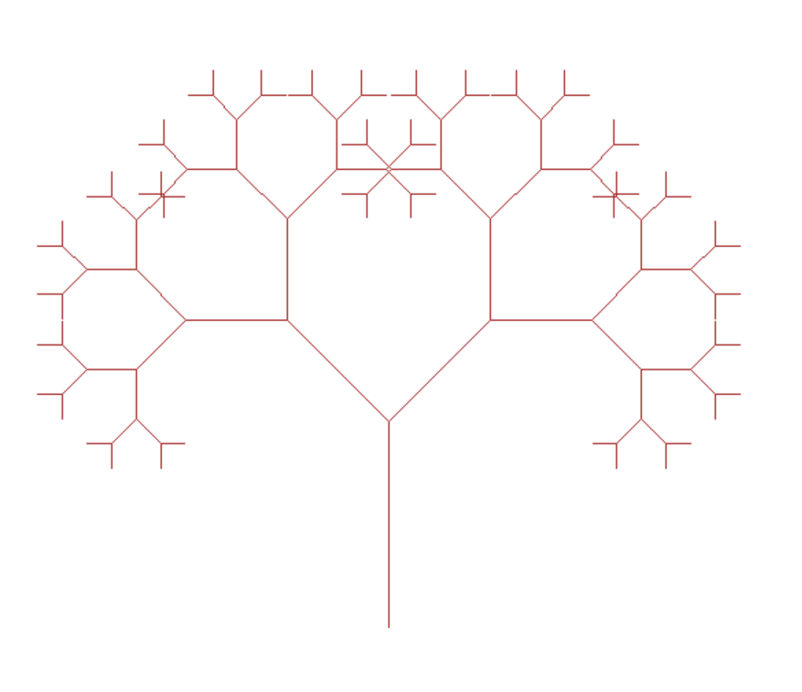
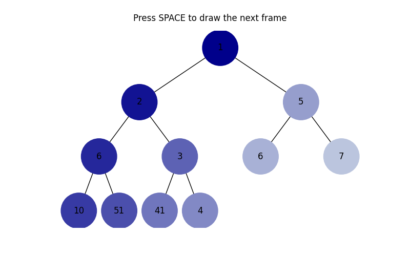
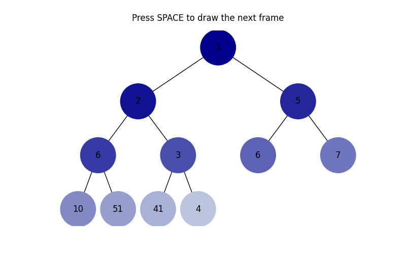

# goit-algo-fp

## Передумова

Налаштуйте `.venv` та встановіть залежності

```bash
python -m venv .venv
.\.venv\Scripts\Activate.ps1
pip install -r requirements.txt
```

## Завдання 1. Структури даних. Сортування. Робота з однозв'язним списком

Для реалізації однозв'язного списку (приклад реалізації можна взяти з конспекту) необхідно:

* написати функцію, яка реалізує реверсування однозв'язного списку, змінюючи посилання між вузлами;
* розробити алгоритм сортування для однозв'язного списку, наприклад, сортування вставками або злиттям;
* написати функцію, що об'єднує два відсортовані однозв'язні списки в один відсортований список.

### Результат виконання

```
Зв'язний список:
15 -> 10 -> 5 -> 20 -> 25 -> None

Зв'язний список після видалення вузла з даними 10:
15 -> 5 -> 20 -> 25 -> None

Шукаємо елемент 15:
15

Зв'язний список список після реверсування:
25 -> 20 -> 5 -> 15 -> None

Зв'язний список після сортування вставками:
5 -> 15 -> 20 -> 25 -> None

Другий відсортований список:
2 -> 10 -> 15 -> 30 -> None

Об'єднаний відсортований список:
2 -> 5 -> 10 -> 15 -> 15 -> 20 -> 25 -> 30 -> None
```

## Завдання 2. Рекурсія. Створення фрактала “дерево Піфагора” за допомогою рекурсії

Необхідно написати програму на Python, яка використовує рекурсію для створення фрактала “дерево Піфагора”. Програма має візуалізувати фрактал “дерево Піфагора”, і користувач повинен мати можливість вказати рівень рекурсії.

### Результат виконання

Для рівня рекурсії `6`:



## Завдання 3. Дерева, алгоритм Дейкстри

Розробіть алгоритм Дейкстри для знаходження найкоротших шляхів у зваженому графі, використовуючи бінарну купу. Завдання включає створення графа, використання піраміди для оптимізації вибору вершин та обчислення найкоротших шляхів від початкової вершини до всіх інших.

### Результат виконання

Виконання для наступного графа і стартової вершини `B`

```python
graph = {
    "A": {"B": 5, "C": 10},
    "B": {"A": 5, "D": 3},
    "C": {"A": 10, "D": 2},
    "D": {"B": 3, "C": 2, "E": 4},
    "E": {"D": 4},
}
```

```
Найкоротші відстані від вершини B: {'A': 5, 'B': 0, 'C': 5, 'D': 3, 'E': 7}
```

<details>
<summary>Лог виконання алгоритму</summary>

```
Початкові відстані: {'A': inf, 'B': 0, 'C': inf, 'D': inf, 'E': inf}
Стартова вершина: B

Вийняли вершину 'B' з відстанню 0 з купи
Розглядаємо сусіда 'A' з вагою ребра 5. Загальна відстань: 5
Знайдено коротший шлях до 'A': 5 (було inf)
Додаємо 'A' з відстанню 5 до купи

Розглядаємо сусіда 'D' з вагою ребра 3. Загальна відстань: 3
Знайдено коротший шлях до 'D': 3 (було inf)
Додаємо 'D' з відстанню 3 до купи

Поточні відстані: {'A': 5, 'B': 0, 'C': inf, 'D': 3, 'E': inf}

Вийняли вершину 'D' з відстанню 3 з купи
Розглядаємо сусіда 'B' з вагою ребра 3. Загальна відстань: 6
Відстань 6 більше збереженої 0. Пропускаємо.

Розглядаємо сусіда 'C' з вагою ребра 2. Загальна відстань: 5
Знайдено коротший шлях до 'C': 5 (було inf)
Додаємо 'C' з відстанню 5 до купи

Розглядаємо сусіда 'E' з вагою ребра 4. Загальна відстань: 7
Знайдено коротший шлях до 'E': 7 (було inf)
Додаємо 'E' з відстанню 7 до купи

Поточні відстані: {'A': 5, 'B': 0, 'C': 5, 'D': 3, 'E': 7}

Вийняли вершину 'A' з відстанню 5 з купи
Розглядаємо сусіда 'B' з вагою ребра 5. Загальна відстань: 10
Відстань 10 більше збереженої 0. Пропускаємо.

Розглядаємо сусіда 'C' з вагою ребра 10. Загальна відстань: 15
Відстань 15 більше збереженої 5. Пропускаємо.

Поточні відстані: {'A': 5, 'B': 0, 'C': 5, 'D': 3, 'E': 7}

Вийняли вершину 'C' з відстанню 5 з купи
Розглядаємо сусіда 'A' з вагою ребра 10. Загальна відстань: 15
Відстань 15 більше збереженої 5. Пропускаємо.

Розглядаємо сусіда 'D' з вагою ребра 2. Загальна відстань: 7
Відстань 7 більше збереженої 3. Пропускаємо.

Поточні відстані: {'A': 5, 'B': 0, 'C': 5, 'D': 3, 'E': 7}

Вийняли вершину 'E' з відстанню 7 з купи
Розглядаємо сусіда 'D' з вагою ребра 4. Загальна відстань: 11
Відстань 11 більше збереженої 3. Пропускаємо.

Поточні відстані: {'A': 5, 'B': 0, 'C': 5, 'D': 3, 'E': 7}

Найкоротші відстані від вершини B: {'A': 5, 'B': 0, 'C': 5, 'D': 3, 'E': 7}
```

</details>

## Завдання 4. Візуалізація піраміди

Код `goit-algo-fp\task_4\main.py` виконує побудову бінарних дерев. Виконайте аналіз коду, щоб зрозуміти, як він працює.

Використовуючи як базу цей код, побудуйте функцію, що буде візуалізувати бінарну купу. Суть завдання полягає у створенні дерева із купи.

### Результат виконання

Візьмемо, для прикладу, несортований масив та перетворимо його на мін-купу

```py
arr = [1, 4, 5, 6, 2, 6, 7, 10, 51, 41, 3]
heapq.heapify(arr) # [1, 2, 5, 6, 3, 6, 7, 10, 51, 41, 4]
```

Також додамо функцію, яка будує дерево із купи

```py
def build_tree_from_heap(heap):
    """Build a binary tree from a heap represented as a list."""
    if not heap:
        return None

    # Create a list of nodes corresponding to the elements in the heap
    nodes = [Node(key) for key in heap]

    for i, node in enumerate(nodes):
        left_index = 2 * i + 1
        right_index = 2 * i + 2
        if left_index < len(nodes):
            node.left = nodes[left_index]
        if right_index < len(nodes):
            node.right = nodes[right_index]

    # The root of the tree is the first element in the list
    return nodes[0]
```

Далі, використовуючи існуючий код, візуалізуємо дані


## Завдання 5. Візуалізація обходу бінарного дерева

Використовуючи код із завдання 4 для побудови бінарного дерева, необхідно створити програму на Python, яка візуалізує обходи дерева: у глибину та в ширину.

Вона повинна відображати кожен крок у вузлах з різними кольорами, використовуючи 16-систему RGB (приклад #1296F0). Кольори вузлів мають змінюватися від темних до світлих відтінків, залежно від послідовності обходу. Кожен вузол при його відвідуванні має отримувати унікальний колір, який візуально відображає порядок обходу.

### Результат виконання

В програму додані методи `dfs` та `bfs` для пошуку в глибину та ширину.
Також доданий графічний двигун, який оновлює фрейми при натисканні клавіши SPACE (пробіл).

**DFS**



**BFS**





