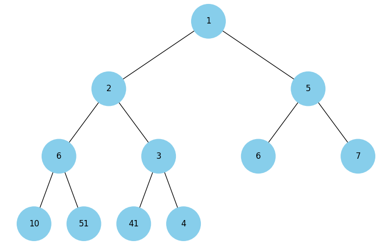
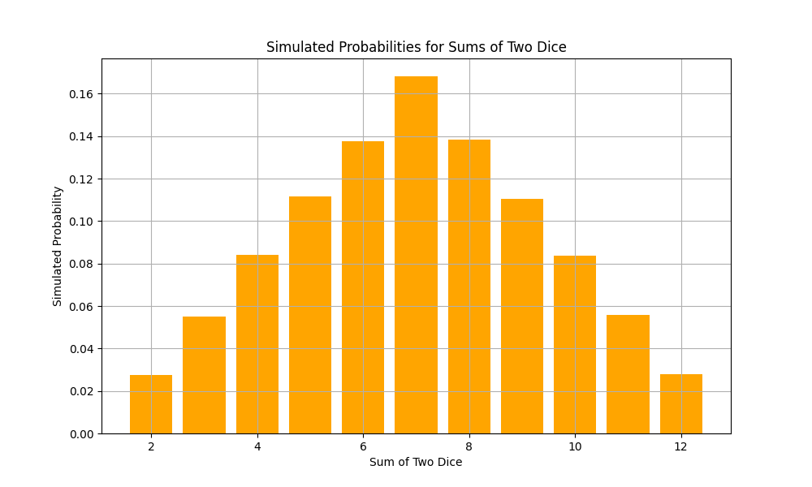

# goit-algo-fp

## Передумова

Налаштуйте `.venv` та встановіть залежності

```bash
python -m venv .venv
.\.venv\Scripts\Activate.ps1
pip install -r requirements.txt
```

## Завдання 1. Структури даних. Сортування. Робота з однозв'язним списком

Для реалізації однозв'язного списку (приклад реалізації можна взяти з конспекту) необхідно:

* написати функцію, яка реалізує реверсування однозв'язного списку, змінюючи посилання між вузлами;
* розробити алгоритм сортування для однозв'язного списку, наприклад, сортування вставками або злиттям;
* написати функцію, що об'єднує два відсортовані однозв'язні списки в один відсортований список.

### Результат виконання

```
Зв'язний список:
15 -> 10 -> 5 -> 20 -> 25 -> None

Зв'язний список після видалення вузла з даними 10:
15 -> 5 -> 20 -> 25 -> None

Шукаємо елемент 15:
15

Зв'язний список список після реверсування:
25 -> 20 -> 5 -> 15 -> None

Зв'язний список після сортування вставками:
5 -> 15 -> 20 -> 25 -> None

Другий відсортований список:
2 -> 10 -> 15 -> 30 -> None

Об'єднаний відсортований список:
2 -> 5 -> 10 -> 15 -> 15 -> 20 -> 25 -> 30 -> None
```

## Завдання 2. Рекурсія. Створення фрактала “дерево Піфагора” за допомогою рекурсії

Необхідно написати програму на Python, яка використовує рекурсію для створення фрактала “дерево Піфагора”. Програма має візуалізувати фрактал “дерево Піфагора”, і користувач повинен мати можливість вказати рівень рекурсії.

### Результат виконання

Для рівня рекурсії `6`:


## Завдання 3. Дерева, алгоритм Дейкстри

Розробіть алгоритм Дейкстри для знаходження найкоротших шляхів у зваженому графі, використовуючи бінарну купу. Завдання включає створення графа, використання піраміди для оптимізації вибору вершин та обчислення найкоротших шляхів від початкової вершини до всіх інших.

### Результат виконання

Виконання для наступного графа і стартової вершини `B`

```python
graph = {
    "A": {"B": 5, "C": 10},
    "B": {"A": 5, "D": 3},
    "C": {"A": 10, "D": 2},
    "D": {"B": 3, "C": 2, "E": 4},
    "E": {"D": 4},
}
```

```
Найкоротші відстані від вершини B: {'A': 5, 'B': 0, 'C': 5, 'D': 3, 'E': 7}
```

<details>
<summary>Лог виконання алгоритму</summary>

```
Початкові відстані: {'A': inf, 'B': 0, 'C': inf, 'D': inf, 'E': inf}
Стартова вершина: B

Вийняли вершину 'B' з відстанню 0 з купи
Розглядаємо сусіда 'A' з вагою ребра 5. Загальна відстань: 5
Знайдено коротший шлях до 'A': 5 (було inf)
Додаємо 'A' з відстанню 5 до купи

Розглядаємо сусіда 'D' з вагою ребра 3. Загальна відстань: 3
Знайдено коротший шлях до 'D': 3 (було inf)
Додаємо 'D' з відстанню 3 до купи

Поточні відстані: {'A': 5, 'B': 0, 'C': inf, 'D': 3, 'E': inf}

Вийняли вершину 'D' з відстанню 3 з купи
Розглядаємо сусіда 'B' з вагою ребра 3. Загальна відстань: 6
Відстань 6 більше збереженої 0. Пропускаємо.

Розглядаємо сусіда 'C' з вагою ребра 2. Загальна відстань: 5
Знайдено коротший шлях до 'C': 5 (було inf)
Додаємо 'C' з відстанню 5 до купи

Розглядаємо сусіда 'E' з вагою ребра 4. Загальна відстань: 7
Знайдено коротший шлях до 'E': 7 (було inf)
Додаємо 'E' з відстанню 7 до купи

Поточні відстані: {'A': 5, 'B': 0, 'C': 5, 'D': 3, 'E': 7}

Вийняли вершину 'A' з відстанню 5 з купи
Розглядаємо сусіда 'B' з вагою ребра 5. Загальна відстань: 10
Відстань 10 більше збереженої 0. Пропускаємо.

Розглядаємо сусіда 'C' з вагою ребра 10. Загальна відстань: 15
Відстань 15 більше збереженої 5. Пропускаємо.

Поточні відстані: {'A': 5, 'B': 0, 'C': 5, 'D': 3, 'E': 7}

Вийняли вершину 'C' з відстанню 5 з купи
Розглядаємо сусіда 'A' з вагою ребра 10. Загальна відстань: 15
Відстань 15 більше збереженої 5. Пропускаємо.

Розглядаємо сусіда 'D' з вагою ребра 2. Загальна відстань: 7
Відстань 7 більше збереженої 3. Пропускаємо.

Поточні відстані: {'A': 5, 'B': 0, 'C': 5, 'D': 3, 'E': 7}

Вийняли вершину 'E' з відстанню 7 з купи
Розглядаємо сусіда 'D' з вагою ребра 4. Загальна відстань: 11
Відстань 11 більше збереженої 3. Пропускаємо.

Поточні відстані: {'A': 5, 'B': 0, 'C': 5, 'D': 3, 'E': 7}

Найкоротші відстані від вершини B: {'A': 5, 'B': 0, 'C': 5, 'D': 3, 'E': 7}
```

</details>

## Завдання 4. Візуалізація піраміди

Код `goit-algo-fp\task_4\main.py` виконує побудову бінарних дерев. Виконайте аналіз коду, щоб зрозуміти, як він працює.

Використовуючи як базу цей код, побудуйте функцію, що буде візуалізувати бінарну купу. Суть завдання полягає у створенні дерева із купи.

### Результат виконання

Візьмемо, для прикладу, несортований масив та перетворимо його на мін-купу

```py
arr = [1, 4, 5, 6, 2, 6, 7, 10, 51, 41, 3]
heapq.heapify(arr) # [1, 2, 5, 6, 3, 6, 7, 10, 51, 41, 4]
```

Також додамо функцію, яка будує дерево із купи

```py
def build_tree_from_heap(heap):
    """Build a binary tree from a heap represented as a list."""
    if not heap:
        return None

    # Create a list of nodes corresponding to the elements in the heap
    nodes = [Node(key) for key in heap]

    for i, node in enumerate(nodes):
        left_index = 2 * i + 1
        right_index = 2 * i + 2
        if left_index < len(nodes):
            node.left = nodes[left_index]
        if right_index < len(nodes):
            node.right = nodes[right_index]

    # The root of the tree is the first element in the list
    return nodes[0]
```

Далі, використовуючи існуючий код, візуалізуємо дані



## Завдання 5. Візуалізація обходу бінарного дерева

Використовуючи код із завдання 4 для побудови бінарного дерева, необхідно створити програму на Python, яка візуалізує обходи дерева: у глибину та в ширину.

Вона повинна відображати кожен крок у вузлах з різними кольорами, використовуючи 16-систему RGB (приклад #1296F0). Кольори вузлів мають змінюватися від темних до світлих відтінків, залежно від послідовності обходу. Кожен вузол при його відвідуванні має отримувати унікальний колір, який візуально відображає порядок обходу.

### Результат виконання

В програму додані методи `dfs` та `bfs` для пошуку в глибину та ширину.
Також доданий графічний двигун, який оновлює фрейми при натисканні клавіши SPACE (пробіл).

**DFS**


**BFS**


## Завдання 6. Жадібні алгоритми та динамічне програмування

Написати програму, яка використовує два підходи — жадібний алгоритм та алгоритм динамічного програмування для розв’язання задачі вибору їжі з найбільшою сумарною калорійністю в межах обмеженого бюджету.

Кожен вид їжі має вказану вартість і калорійність. Дані про їжу представлені у вигляді словника, де ключ — назва страви, а значення — це словник з вартістю та калорійністю.

```py
items = {
    "pizza": {"cost": 50, "calories": 300},
    "hamburger": {"cost": 40, "calories": 250},
    "hot-dog": {"cost": 30, "calories": 200},
    "pepsi": {"cost": 10, "calories": 100},
    "cola": {"cost": 15, "calories": 220},
    "potato": {"cost": 25, "calories": 350}
}
```

Розробіть функцію `greedy_algorithm` жадібного алгоритму, яка вибирає страви, максимізуючи співвідношення калорій до вартості, не перевищуючи заданий бюджет.

Для реалізації алгоритму динамічного програмування створіть функцію `dynamic_programming`, яка обчислює оптимальний набір страв для максимізації калорійності при заданому бюджеті.


### Результат виконання

```
Вибрані страви (жадібний алгоритм):
cola: вартість = 15, калорійність = 220
potato: вартість = 25, калорійність = 350
pepsi: вартість = 10, калорійність = 100
hot-dog: вартість = 30, калорійність = 200
Загальна вартість: 80
Загальна калорійність: 870

Вибрані страви (динамічне програмування):
pizza: вартість = 50, калорійність = 300
pepsi: вартість = 10, калорійність = 100
cola: вартість = 15, калорійність = 220
potato: вартість = 25, калорійність = 350
Загальна вартість: 100
Загальна калорійність: 970
```

Жадібний алгоритм не завжди є оптимальним підходом для задачі, оскільки він фокусується лише на локально найкращому співвідношенні "ціна-калорії". Це може призвести до недовикористання бюджету і, як наслідок, меншої загальної калорійності.

Алгоритм динамічного програмування забезпечує оптимальний результат, використовуючи весь доступний бюджет і максимізуючи загальну калорійність, хоча і використовую при цьому більше ресурсів - він враховує всі можливі комбінації, що дозволяє досягти кращого результату в порівнянні з жадібним підходом.


## Завдання 7. Використання методу Монте-Карло

Необхідно написати програму на Python, яка імітує велику кількість кидків кубиків, обчислює суми чисел, які випадають на кубиках, і визначає ймовірність кожної можливої суми.

Створіть симуляцію, де два кубики кидаються велику кількість разів. Для кожного кидка визначте суму чисел, які випали на обох кубиках. Підрахуйте, скільки разів кожна можлива сума (від 2 до 12) з’являється у процесі симуляції. Використовуючи ці дані, обчисліть імовірність кожної суми.

На основі проведених імітацій створіть таблицю або графік, який відображає ймовірності кожної суми, виявлені за допомогою методу Монте-Карло.

Таблиця ймовірностей сум при киданні двох кубиків виглядає наступним чином.

| Сума | Імовірність    |
|------|----------------|
| 2    | 2.78% (1/36)   |
| 3    | 5.56% (2/36)   |
| 4    | 8.33% (3/36)   |
| 5    | 11.11% (4/36)  |
| 6    | 13.89% (5/36)  |
| 7    | 16.67% (6/36)  |
| 8    | 13.89% (5/36)  |
| 9    | 11.11% (4/36)  |
| 10   | 8.33% (3/36)   |
| 11   | 5.56% (2/36)   |
| 12   | 2.78% (1/36)   |

Порівняйте отримані за допомогою методу Монте-Карло результати з аналітичними розрахунками, наведеними в таблиці вище.

### Результат виконання

Використовуючи метод Монте-Карло при 100,000 симуляціях, отримані наступні результати



|   Сума |   Імовірність |
|-------:|--------------:|
|      2 |       0.02818 |
|      3 |       0.0565  |
|      4 |       0.08139 |
|      5 |       0.11043 |
|      6 |       0.13634 |
|      7 |       0.16758 |
|      8 |       0.13992 |
|      9 |       0.11055 |
|     10 |       0.0849  |
|     11 |       0.05573 |
|     12 |       0.02848 |

### Висновок

Результати симуляції дуже близькі до теоретичних ймовірностей, отриманих аналітичним шляхом. Це підтверджує, що метод Монте-Карло досить точно моделює ймовірності для суми чисел при киданні двох кубиків.
